<h1 align="center">
  
</h1>

<h5 align="center">
  <code><a href="https://www.linkedin.com/in/ziad-ahmed-fouad" title="LinkedIn Profile"> LinkedIn</a></code>
  <code><a href="https://tryhackme.com/p/Ziadch" title="Tryhackme Profile"> Tryhackme</a></code>
</h5>
 

  Hi, I'm Ziad (0Xmorsky), Cyber Security Student & Bug Bounty Hunter from Egypt  
   
   
🛡️ I'm currently working as a Red Teamer & Penetration Tester  
   
🎯 Active in Bug Bounty programs and Capture The Flag (CTF) competitions  
   
💻 I love writing code, building security tools, and exploring system internals  
   
📚 I’m currently learning API Security Testing, Windows & Android Architecture, and Quantum Computing fundamentals  
   
🚀 Passionate about Cyber Security research, OSINT, and advanced Red Team operations  
   
💬 Ask me anything about Cyber Security, Bug Bounty, or Penetration Testing  
   
📫 How to reach me: <a href="mailto:zksaar01@gmail.com">zksaar01@gmail.com</a>  

<h2 align="center">🔥 Languages & Frameworks & Tools & Abilities 🔥</h2>
 

<code></code>
<code></code>
<code></code>
<code></code>
<code></code>
<code></code>
<code></code>
<code></code>
<code>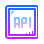</code>
<code>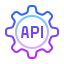</code>
<code></code>
<code></code>
<code></code>
<code></code>
<code></code>
<code></code>
<code></code>
<code></code>
<code></code>
<code></code>
<code></code>
<code></code>
<code>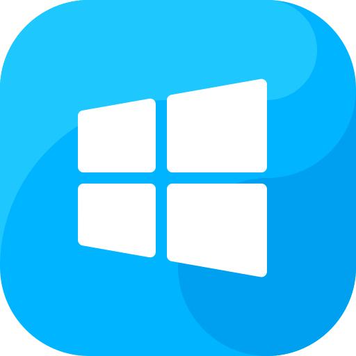</code>
<code>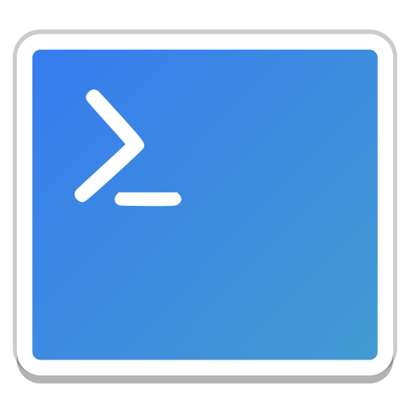</code>
<code></code>
<code></code>
<code></code>
<code>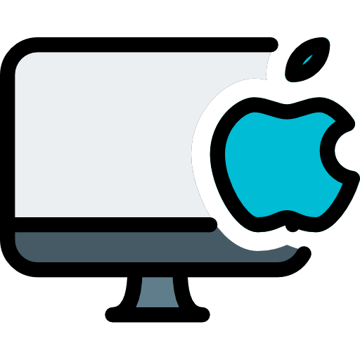</code>
<code></code>
<code>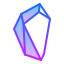</code>
<code></code>
<code></code>
<code>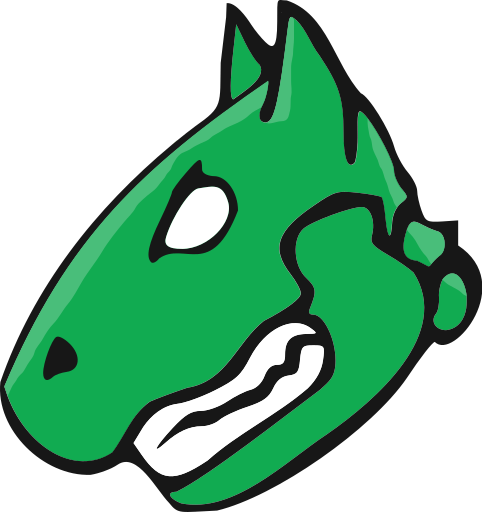</code>
<code>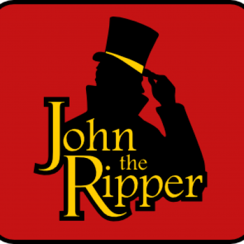</code>
<code>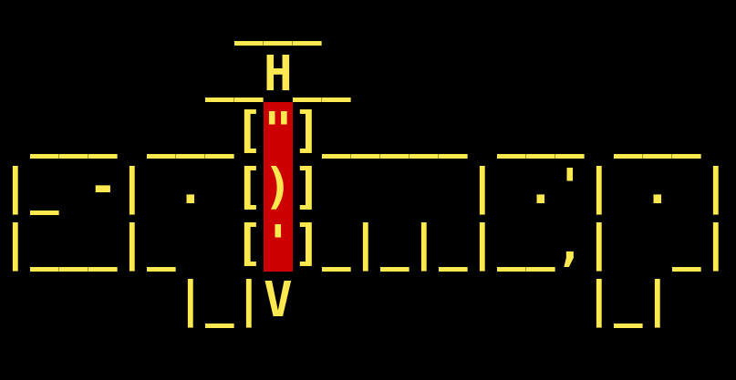</code>
<code></code>
<code></code>
<code></code>
<code></code>
<code></code>
<code></code>
<code></code>
<code></code>
<code></code>
<code>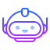</code>
<code>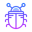</code>
<code></code>
<code>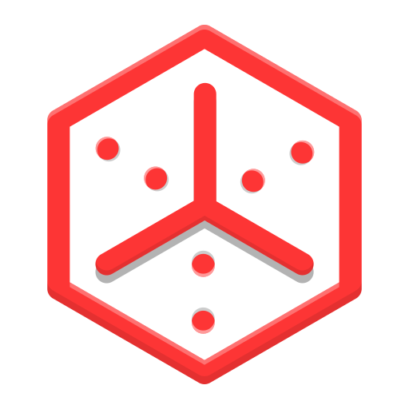</code>
<code>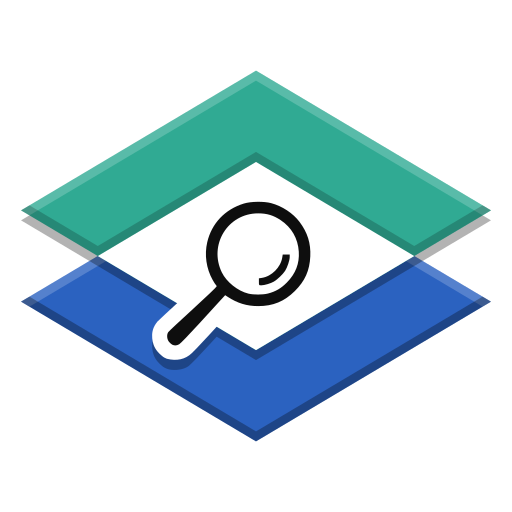</code>
<code></code>
<code></code>
<code>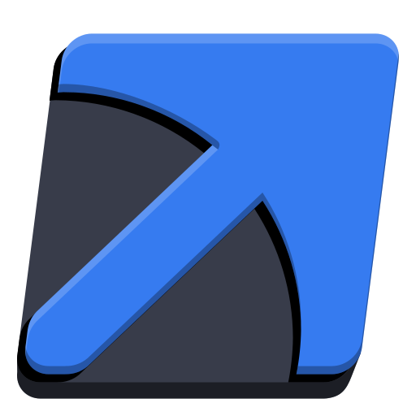</code>
<code>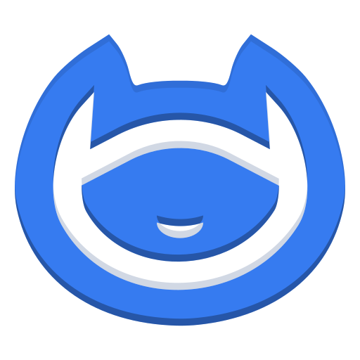</code>
<code>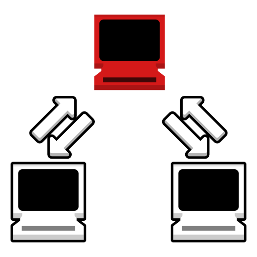</code>
<code>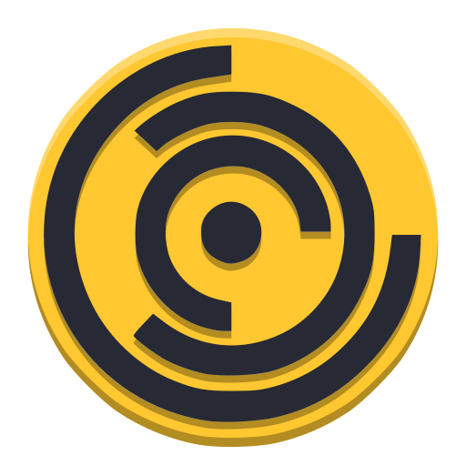</code>
<code>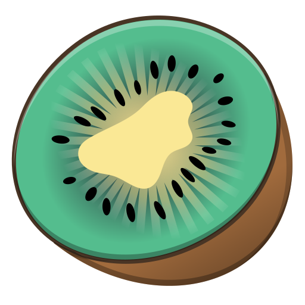</code>
<code>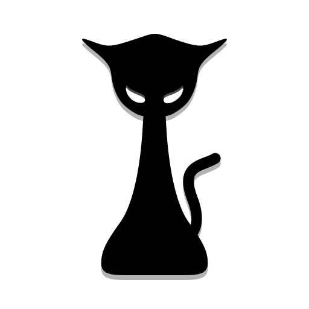</code>
<code></code>
<code>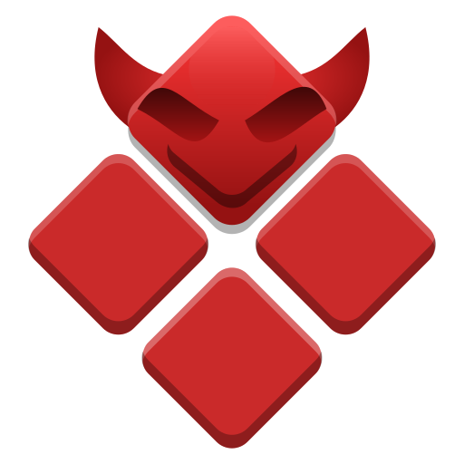</code>
<code>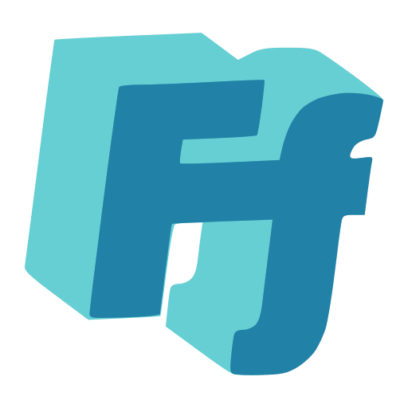</code>
<code>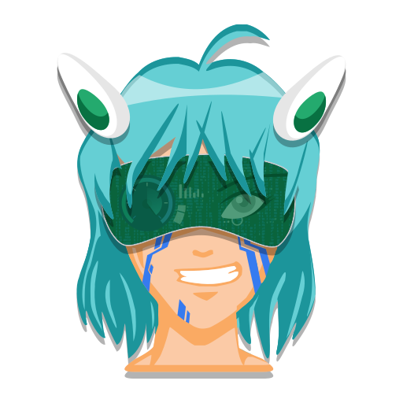</code>
<code></code>
<code>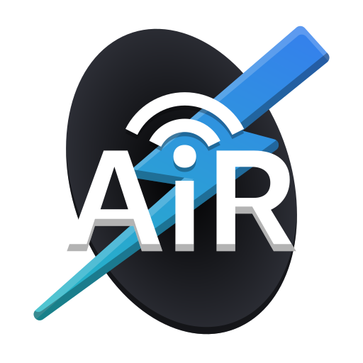</code>
<code></code>
<code></code>
<code>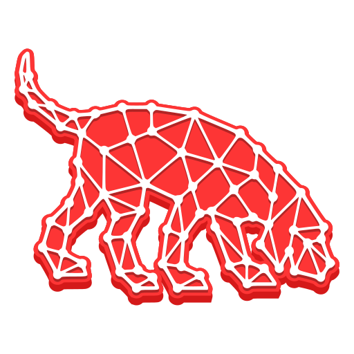</code>
<code></code>
<code></code>
<code></code>
<code></code>
<code>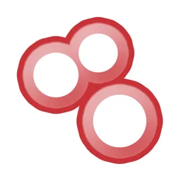</code>
<code></code>

<h2 align="center">⚡ Stats ⚡</h2>
 

  

    
  

 
