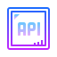
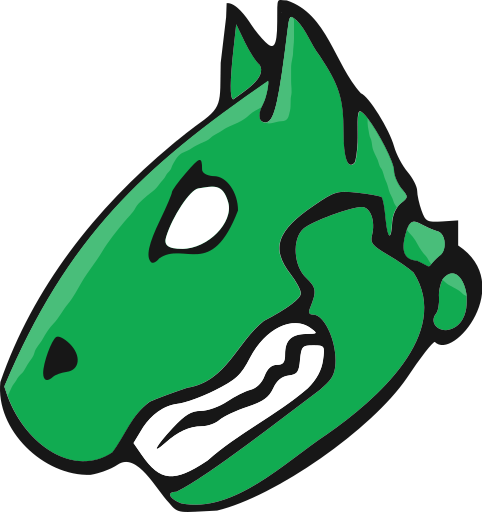
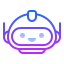
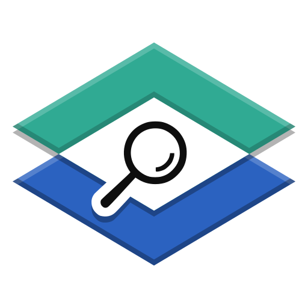

<h1 align="center">
  
</h1>

<h5 align="center">
  <code><a href="https://www.linkedin.com/in/ziad-ahmed-fouad" title="LinkedIn Profile"> LinkedIn</a></code>
  <code><a href="https://tryhackme.com/p/Ziadch" title="Tryhackme Profile"> Tryhackme</a></code>
  <code><a href="https://medium.com/@zksaar01" title="Medium blog"> Medium blog</a></code>
  <code><a href="https://x.com/X0Dzeko" title="Instagram Profile"> twitter</a></code>
</h5>
 

  Hi, I'm Ziad (0Xmorsky), Cyber Security Student & Bug Bounty Hunter from Egypt  
   
   
🛡️ I'm currently working as a Red Teamer & Penetration Tester  
   
🎯 Active in Bug Bounty programs and Capture The Flag (CTF) competitions  
   
💻 I love writing code, building security tools, and exploring system internals  
   
📚 I’m currently learning API Security Testing, Windows & Android Architecture, and Quantum Computing fundamentals  
   
🚀 Passionate about Cyber Security research, OSINT, and advanced Red Team operations  
   
💬 Ask me anything about Cyber Security, Bug Bounty, or Penetration Testing  
   
📫 How to reach me: <a href="mailto:zksaar01@gmail.com">zksaar01@gmail.com</a>  

<h2 align="center">🔥 Languages & Frameworks & Tools & Abilities 🔥</h2>
 

  <code></code>
  <code></code>
  <code></code>
  <code></code>
  <code></code>
  <code></code>
  <code></code>
  <code></code>
  <code></code>
  <code></code>
  <code></code>
  <code></code>
  <code></code>
  <code></code>
  <code></code>
  <code></code>
  <code></code>
  <code></code>
  <code></code>
  <code></code>
  <code></code>
  <code></code>
  <code></code>
  <code></code>
  <code></code>
  <code></code>
  <code></code>
  <code></code>
  <code></code>
  <code></code>
  <code></code>
  <code></code>
  <code></code>
  <code></code>
  <code></code>
  <code></code>
  <code></code>
  <code></code>
  <code></code>
  <code></code>
  <code></code>
  <code></code>
  <code></code>
  <code></code>
  <code></code>
  <code></code>
  <code></code>
  <code></code>
  <code></code>
  <code></code>
  <code></code>
  <code></code>
  <code></code>
  <code></code>
  <code></code>
  <code></code>
  <code></code>
  <code></code>
  <code></code>
  <code></code>
  <code></code>
  <code></code>
  <code></code>
  <code></code>
  <code></code>
  <code></code>
  <code></code>
  <code></code>
  <code></code>
  <code></code>
  <code></code>
  <code></code>

<h2 align="center">⚡ Stats ⚡</h2>
 

  

    
    
  

           
  

    
  

   

  

<h2 align="center">👨‍💻 Repositories 👨‍💻</h2>
 

  

      

  
  

      

  
  

      

<h4 align="center">
  <a href="https://github.com/zumrudu-anka?tab=repositories" title="Show Repositories">🔎 Show More 🔍</a>
</h4>

<!--
**zumrudu-anka/zumrudu-anka** is a ✨ _special_ ✨ repository because its `README.md` (this file) appears on your GitHub profile.

Here are some ideas to get you started:

- 🔭 I’m currently working on ...
- 🌱 I’m currently learning ...
- 👯 I’m looking to collaborate on ...
- 🤔 I’m looking for help with ...
- 💬 Ask me about ...
- 📫 How to reach me: ...
- 😄 Pronouns: ...
- ⚡ Fun fact: ...

Notes: If you want use this readme, firstly star it please. If you can't align your repositories like this, please change your repository desription to shorter than now. Maybe 4 or 5 word will be good.

-->
